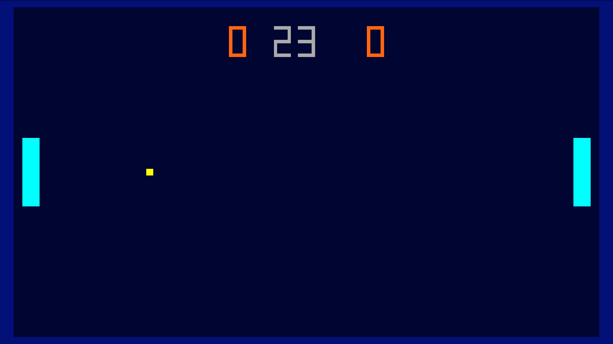

# Gong

### Description

Gong is a libretro port of Pong. It is based on Brad Parker's version of Pong.

### License

GPL v3

### Icon

### Fanart

Help make me fanart!

### Screenshots

### Disclaimer

*Original source code by Dan Zaidan - https://danzaidan.itch.io*
